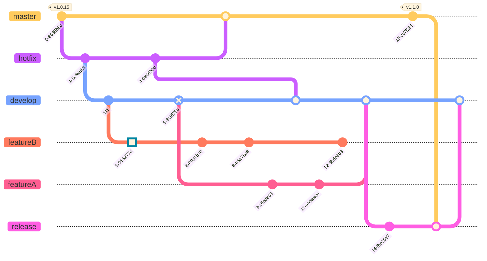
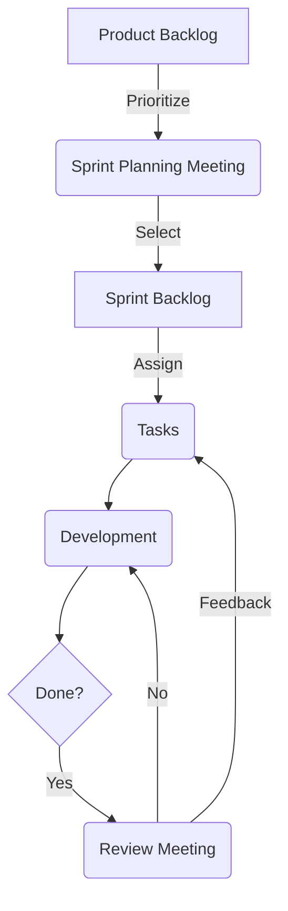

## Introduction
Process is one of the important parts of the project. Compliance with the process is the responsibility of each programmer. We always promote discipline and seriousness of each individual.
Below is a guide for you on some common processes and standards for the entire project including:
1. [Preparation steps before developing this project](#1-preparation-steps-before-developing-this-project)
2. [Branching and commit organization standards](#2-branching-and-commit-organization-standards)
3. [General working process for programmer position](#3-general-working-process-for-programmer-position)

## Guideline

### 1. Preparation steps before developing this project
You need to pull the source code from the repo. Before starting to code, you need to set up some folders and files to help unify the team's coding standards

Step1: prettier config
<details>
<summary>For Vscode</summary>
If you used vscode, you must config this line bellow in .vscode/setting.json.
If you don't already have it, please create it.

```javascript
{
    ...,
    "editor.formatOnSave": true,
    "editor.defaultFormatter": "esbenp.prettier-vscode"
}
```
</details>

Step2: Husky config
```javascript
npm run prepare
```

Step3: Enjoy your code
```javascript
# for dev
yarn start
# for build
yarn build
# for preview my build
yarn preview
```

### 2. Branching and commit organization standards
```
# For common brach, their name must be follow this convention:
    <type>/<business-group>-<ticket-number>_<purpose>
    - type, business-group and purpose required
    - ticket-number is optional
```
Ex: feature/claims-45_add-policy-comparison.

<details>
<summary>type</summary>

### Detail for type list
* hotfix: for quickly fixing critical issues, usually with a temporary solution
* fixbug: for fixing a bug
* feature: for adding, removing or modifying a feature
* test: for experimenting something which is not an issue
* wip: 	for a work in progress
</details>

<details>
<summary>business-group</summary>
what is business logic for your code.
</details>

<details>
<summary>purpose</summary>
what is your purpose of your code.
</details>

<details>
<summary>ticket-number</summary>
ticket's id you processing for this code.
</details>

> [!NOTE]
> This structure can be tailored to specific projects.
------------

#### a. Code convention rules
All pull request must be check with list condition.

| Item                                                                                | Pass: P /Fail: N /NA |
| ----------------------------------------------------------------------------------- | -------------------- |
| NO code duplication                                                                 |                      |
| NO spelling and grammar mistakes                                                    |                      |
| NO console.X(), unused code, import statements                                      |                      |
| USE lower, kebab case for route/page url                                            |                      |
| USE 'const' to declare variable unless it mutable                                   |                      |
| USE dot notation instead of square bracket, except dynamic object                   |                      |
| USE native api instead of 3rd library, e.g Array.forEach instead lodash \_.forEach  |                      |
| DECLARE const variable for repeated value                                           |                      |
| DECLARE variable or helper function for complicated expression(if else condition)   |                      |
| KEEP naming of variables/functions short, clean, selft descriptive                  |                      |
| AVOID use ANY, always define interface for data, e.g component props, api response  |                      |
| AVOID big code block, consider to BREAK into small functions(around 30 lines is ok) |                      |
| MINIMIZE logic in the render function, move to helpers or components                |                      |
| SPLIT component as small as possible, follow single responsibility principle        |                      |
| LANGUAGE key must be added to all translation files                                 |                      |
| CHECK current translation for new language key and use if exist                     |                      |

#### b. Commit rules

```
# For common rule, a commit includes 3 components:
    <type>: <description> [body]
    - type and description are required
    - body is optional
```

<details>
<summary>type</summary>

### Detail for type list
* feat: a new feature (feature)
* fix: fix bug
* docs: capture documents (edit documents)
* style: Add space, format code, missing punctuation marks
* refactor: Rename function, variables, separate function and more refactor code,...
* perf: Performance improvements
* test: Add more test case, edit unit test
* build: Change build process: package.json, build line,...
* ci: Update file script for ci/cd process: yml, docker-compose,...
</details>

<details>
<summary>description</summary>

### Detail and rule for description
* Concise description of commit content
* No longer than 50 characters so it can be easily read on github, as well as other git tools
* Use imperative sentences, in the present tense. Ex: "change..." instead "changed..."
* Do not capitalize the first letter
* Do not use commas at the end of sentences
</details>

<details>
<summary>body</summary>

### Detail and rule for body
* Optional part, used to describe the commit in more detail if you needed
* Has a blank line with a description before it
* Use WH questions (what|When|Why) instead How question
</details>

> [!NOTE]
> This structure can be tailored to specific projects.

#### c. Git Graph
Every branch which used for fix bug, create new features,... alway checkout and create a pull request when done. Follow this diagram bellow


### 3. General working process for programmer position

